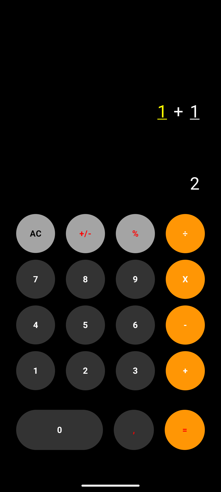

# Faculdade de Tecnologia de São Paulo - FATEC-SP
## Atividade Prática - PDMII
### Aluno: Diego Baltazar

# Descrição do Projeto

Este projeto consiste no desenvolvimento de uma calculadora Android utilizando **Kotlin** e **Jetpack Compose**, com foco na aplicacao pratica de **gerenciamento de estado reativo**.

A proposta da atividade e construir uma interface 100% Compose, com atualizacao do visor em tempo real a cada interacao do usuario e implementacao das operacoes matematicas basicas.

## Imagem do Aplicativo


## Objetivo da Atividade

Desenvolver um aplicativo de calculadora aplicando os conceitos de:

- composicao de interface com Jetpack Compose;
- controle de estado com as ferramentas do Compose;
- separacao entre interface e regra de negocio;
- tratamento de erros basicos em operacoes matematicas.

## Requisitos do Aplicativo

- **Interface (UI):** feita 100% em Compose;
- **Visor:** exibicao dos numeros e resultado de forma reativa;
- **Botoes:** operacoes `+`, `-`, `*`, `/`;
- **Gerenciamento de estado:** atualizacao em tempo real a cada clique;
- **Regra de negocio:** realizacao correta das contas e tratamento de erros basicos.

## Tecnologias Utilizadas

- Kotlin
- Jetpack Compose
- Material 3
- Android Studio
- Gradle (KTS)

## Gerenciamento de Estado (Compose)

No projeto, o estado da calculadora e mantido com `rememberSaveable`, garantindo que os dados principais da tela sejam preservados em recomposicoes:

- valores dos campos numericos (`num1` e `num2`);
- campo atualmente selecionado;
- resultado exibido no visor.

Com isso, a UI responde automaticamente as mudancas de estado, sem necessidade de atualizar componentes manualmente.

## Estrutura Principal

- `app/src/main/java/com/atividade/calculadora/screens/CalculadoraScreen.kt`: tela principal, composables e logica da calculadora.
- `app/src/main/java/com/atividade/calculadora/ui/theme/`: configuracoes de tema, cores e tipografia.

## Como Executar o Projeto

### 1) Requisitos

- Android Studio instalado;
- SDK Android configurado;
- JDK compativel com o projeto.

### 2) Passos

1. Clone o repositorio:
   ```bash
   git clone <URL_DO_REPOSITORIO>
   ```
2. Abra o projeto no Android Studio.
3. Aguarde o Gradle sincronizar.
4. Execute o app em emulador ou dispositivo fisico.

## Observacoes

Este repositorio foi desenvolvido para fins academicos na disciplina de PDMII (Programacao de Dispositivos Móveis II).


